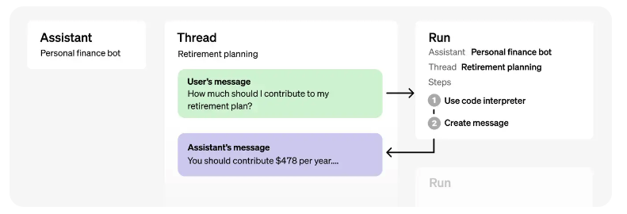

##  Create an Assistant with Open AI
....

Documentation :
- [Assistants API](https://platform.openai.com/docs/assistants/overview)

source: https://platform.openai.com/docs/assistants/how-it-works
- [Learn more: How Assistants work](https://platform.openai.com/docs/assistants/how-it-works)
- [Create Assistants](https://platform.openai.com/docs/assistants/how-it-works/creating-assistants)

## Dependencies :

- **openai**: Official OpenAI API wrapper for Node.js
- **dreadline-sync**: Synchronous Readline for interactively running to have a conversation with the assistant
- **dotenv**: Loads environment variables from .env file


## Add an API KEY - [Api Keys](https://platform.openai.com/account/api-keys)

inside the **.env** file, add your unique key

```
# your unique API key value goes here
OPENAI_API_KEY=sk-############

```

## Installation :
`npm install`

## Start the project :
`npm start`


